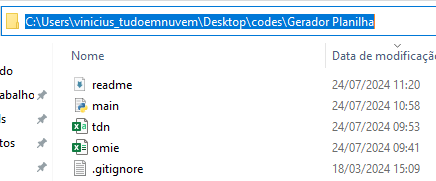
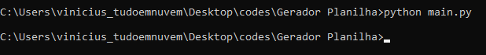

# Conciliar omie com painel

### Para que serve?

- Verificar divergência de planos dos clientes entre omie e painel do google.

### Requisitos

- Python3
- Relatório do dia da Omie em excel
- Relatório de clientes do painel do google em csv
- Cérebro

## Como usar

1. Com os relatórios da omie e painel em mãos, é preciso renomea-los para os nomes `omie` e `tdn` de acordo com o relatório. Ambos precisam estar na mesma pasta que o arquivo main.py.
2. Abrir prompt de comando (cmd) dentro do diretório onde se encontra o arquivo main.py e os relatórios
   2.1 para isso, é só abrir a pasta no explorer, clicar na barra de endereço do diretório, digitar `cmd` e dar "Enter".
   
3. Com o prompt aberto e python instalado, basta digitar `python main.py` para executar o script.

    

4. Ao executar o script, vai ser gerado um arquivo com o nome do dia dos respectivos dias do relatório da omie.
5. Enviar arquivo para a Beth :P
